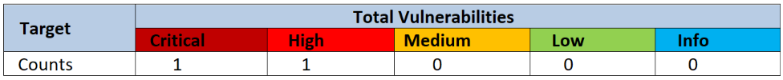
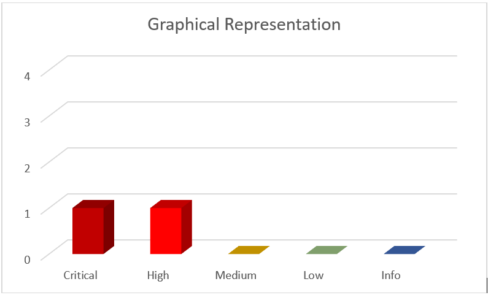
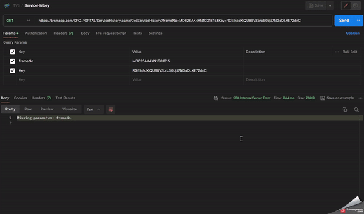
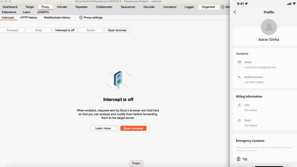

# TVS Connect Mobile Application
This repository contains a detailed list of all the vulnerabilities, found accorss the TVS Connect mobile application by the security team at FEV LTD.

# Table of Contents

1. [Introduction](#introduction)
    - [Overview](#overview)
2. [Summary](#summary)
3. [Detailed Description of the Vulnerabilities and Findings](#detailed-description-of-the-vulnerabilities-and-findings)
    - [Vulnerabilities](#vulnerabilities)
        - [Unauthenticated Access to Service History of Any Users](#unauthenticated-access-to-service-history-of-any-users)
        - [Logical Flaw: ADD and DELETE Emergency Contact for Any User](#logical-flaw-add-and-delete-emergency-contact-for-any-user)
        - [Broken Cryptography: Leaked secrets on Android and iOS application platforms](

## Introduction
TVS Connect is a mobile application designed to streamline communication and enhance connectivity between TVS vehicle owners and their vehicles. It aims to provide users with convenience and peace of mind by offering real-time updates and personalized assistance for their vehicles.

### Overview
A security evaluation was conducted on the application to pinpoint possible weaknesses that could be exploited by adversaries in real-world scenarios, aiding the company in defending against cyber attacks of any nature.

## Summary

Total of 02 risks were identified during the test.

  
   
  <em>Summary of Vulnerabilities</em>

  
   
  <em>GraphicalRepresentation.png</em>

## Detailed Description of the Vulnerabilities and Findings

### Vulnerabilities

#### Unauthenticated Access to Service History of Any Users
#### CVE-2024-33309

#### Logical Flaw: ADD and DELETE Emergency Contact for Any User
#### CVE-2024-33308

#### Broken Cryptography: Leaked secrets on Android and iOS application platforms
#### CVE-2024-35537

## Pentesters
 - **Aarav Sinha** [https://in.linkedin.com/in/aarav-sinha-749047159](#)
 - **Vaishali Nagori** [https://in.linkedin.com/in/vaishali-nagori](#)
